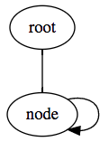

## Issue description

`json-schema-ref-parser`'s `.bundle()` method seems to have trouble with additional properties on `$ref` objects in certain cases where recursive schemas are used.
For example with a linked list schema, which references itself on the `next` property.



This is a schema for a linked list node:

```json
{
    "$id": "Node.schema.json",
    "definitions": {
        "node": {
            "type": "object",
            "properties": {
                "data": {
                    "description": "Some data",
                    "type": "integer"
                },
                "next": {
                    "$ref": "#/definitions/node"
                }
            }
        }
    }
}

```


If that schema is then referenced through a `$ref` object happens to contain an additional property, in this case `title`:

```json
{
    "$id": "LinkedList.schema.json",
    "definitions": {
        "linkedList": {
            "$ref": "Node.schema.json#/definitions/node",
            "title": "linkedList"
        }
    }
}
```

The resulting bundle that `json-schema-ref-parser` produces looks like this:

```json
{
    "$id": "LinkedList.schema.json",
    "definitions": {
        "linkedList": {
            "$ref": "#/definitions/linkedList/properties/next",
            "title": "linkedList"
        }
    }
}
```

Note how the definition for the node schema isn't included in the bundle, and the `$ref` object references itself.

## Caveats

Interestingly enough, the issue does not occur when the node schema's `next` `$ref` object _also_ contains an additional property. It also does not occur when _only_ the node schema's `next` `$ref` object contains an additional property.

Here's a table of when the issue occurs:

| Folder                    |                                       Setup                                       |            Issue occurs?            |
|---------------------------|:---------------------------------------------------------------------------------:|:-----------------------------------:|
| [LinkedList]              | Basic linked list schema                                                          | [No][LinkedListOutput]              |
| [LinkedListRootRefTitle]  | Linked list with additional property on root $ref object (LinkedList.schema.json) | [Yes][LinkedListRootRefTitleOutput] |
| [LinkedListNextRefTitle]  | Linked list with additional property on next $ref object (Node.schema.json)       | [No][LinkedListNextRefTitleOutput]  |
| [LinkedListBothRefsTitle] | Linked list with additional property on both $ref objects                         | [No][LinkedListBothRefsTitleOutput] |

## Instructions for local setup

```bash
yarn install && yarn run start
```

This will install dependencies and regenerate the bundles.

[LinkedList]: src/LinkedList
[LinkedListRootRefTitle]: src/LinkedListRootRefTitle
[LinkedListNextRefTitle]: src/LinkedListNextRefTitle
[LinkedListBothRefsTitle]: src/LinkedListBothRefsTitle

[LinkedListOutput]: src/LinkedList/LinkedList.bundled.schema.json
[LinkedListRootRefTitleOutput]: src/LinkedListRootRefTitle/LinkedList.bundled.schema.json
[LinkedListNextRefTitleOutput]: src/LinkedListNextRefTitle/LinkedList.bundled.schema.json
[LinkedListBothRefsTitleOutput]: src/LinkedListBothRefsTitle/LinkedList.bundled.schema.json
